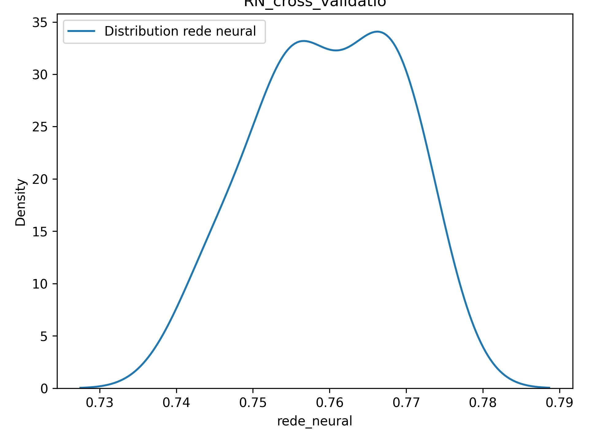

### Project Housing Boston

1. **About Boston housing data**
Construct a working model which has the capability of predicting the value of houses. The features ‘RM’, ‘LSTAT’ and ‘PTRATIO’ give us quantitative information about each data point. The Target variable, ‘MEDV’ is the variable we seek to predict.

2. **Content/Attribute Information**
Note: 1) RM is the average number of rooms among homes in the neighbourhood 2) LSTAT is the % of homeowners in the neighbourhood considered lower class / working poor 3) PTRATIO is the ratio of students to teachers in primary and secondary schools in the neighbourhood

3. **Neural Network (MLPRegressor)**

rede_neural_regressor = **MLPRegressor**(hidden_layer_sizes=(10,10), activation='relu', max_iter=2000, solver="adam" )

4. **Metrics(With StanterScaler())**

|Metric| Value|
|------|------|
|Coeficinte de determinação: |0.8211|
|Erro absoluto:| 22917.4744|
|Erro médio absoluto:| 0.3313|
|Erro raiz erro quadratico medio:| 0.4361|

5. **CrossValidation K-Fold**

